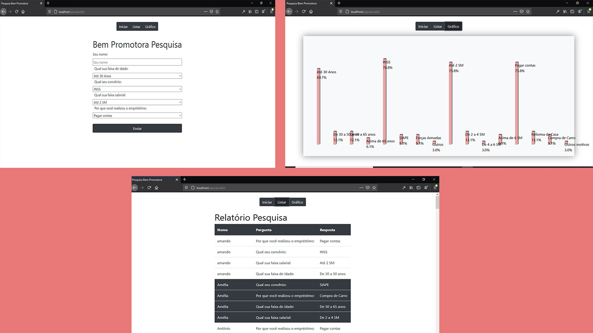

# Ajax Dynamic Graphic 

#### This code comes from a test I did for a company.

## Views

### The challenge
*  do a survey with your customers looking for questions from the database.
* save the answers in the bank.

### Extra implementations
* A report with the survey responses.
*  A dynamically generated graph with the percentage of each answer.

